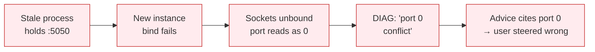
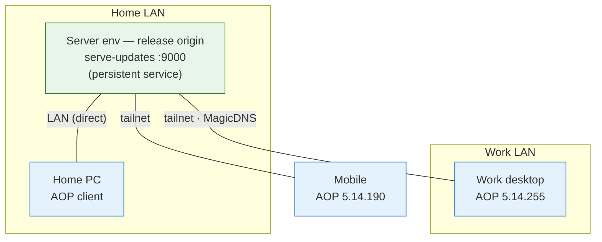
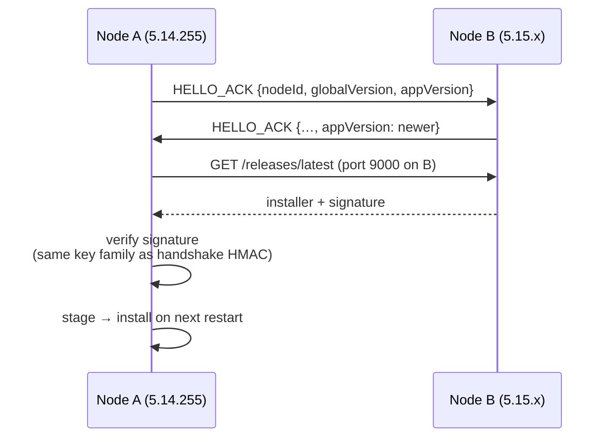

# AOP (ArbetsOrderProgram) — Update & Sync Analysis

Analysis of the work-desktop DIAG output (2026-06-12) and a target
topology for smooth updates in **both directions** (work desktop ↔ home
PC/server), over **both** transports (LAN and internet via Tailscale).

Observed estate:

| Node          | Platform | AOP version       | Role                      |
|---------------|----------|-------------------|---------------------------|
| Mobile        | mobile   | 5.14.190          | legacy                    |
| Work desktop  | win32    | 5.14.255          | legacy (DIAG source)      |
| Home server   | —        | newer than 5.14.255 | release origin          |

All nodes share a Tailscale tailnet. The 2026-06-12 log bundle exported
from the work desktop contains **zero log files** (`files: 0` in the
header) — see §5.

---

## 1. What the DIAG actually says

| Reported symptom                                            | Likely reality                                                                                      | Class      |
|-------------------------------------------------------------|-----------------------------------------------------------------------------------------------------|------------|
| "Port 5050 has active connections but may not be listening" | A previous/zombie AOP instance (or another app) still holds the default LAN-sync port               | root cause |
| "UDP Not Bound · TCP Not Listening · Port: 0"               | Bind failed, so the UI reads the port off an **unbound socket** → 0. Port 0 is a symptom, not a setting | symptom    |
| "Port 0 is already in use by another application"           | Misdiagnosis: the conflict template interpolates the unbound socket port instead of the configured one | diag bug   |
| "Add firewall rule allowing TCP port 0"                     | Nonsense advice produced by the same template bug                                                    | diag bug   |
| Interfaces table empty, "Address: Not detected"             | Interface enumeration returned nothing → subnet broadcasts can't be computed; only 255.255.255.255 remains, which is widely filtered | bug        |
| "Cannot connect to update server (port 9000)"               | No update server is running anywhere reachable; `npm run serve-updates` is a dev workaround, not a deployment | gap        |
| Log bundle `files: 0`                                       | Exporter bundled no logs — export bug or logging disabled                                            | bug        |

Root-cause chain for the LAN-sync panel:

---

## 2. Immediate unblock (work desktop)

1. Find the holder of the default port:
   `netstat -ano | findstr :5050` → note PID → `taskkill /PID <pid> /F`
   (or reboot).
2. If the port must move, set the LAN-sync port to **5051 on every
   node** — the port must match estate-wide.
3. Windows Defender Firewall: inbound allow, **TCP + UDP**, chosen port,
   private profile.
4. Skip broadcast discovery entirely: add peers manually using their
   **Tailscale addresses** (§3). UDP broadcast never crosses the tailnet
   and the interface-enumeration bug breaks it even on LAN.

---

## 3. Target update topology

Tailscale dissolves the LAN-vs-internet split: MagicDNS names resolve
everywhere, and Tailscale takes the direct LAN path automatically when
two peers share a subnet. One address per node covers both transports.

- Run `serve-updates` on the **home server** as a persistent service
  (systemd / pm2 / Docker restart-policy), bound to the Tailscale
  interface (plus LAN if wanted). No node should depend on a manually
  started dev server.
- Point every node's update URL at `http://<server-magicdns>:9000`.
- Update ring: **server → desktops → mobile**. The build node is always
  newest; clients only pull.

---

## 4. Bidirectional option — peer-served updates

"Both desktop to PC and PC to desktop": if any node may be newest, not
only the server, extend the existing LAN-sync handshake instead of
inventing a new channel. HELLO already carries `nodeId + globalVersion`;
add `appVersion`.

Rules:

- A node **offers** an update only if it holds the release file locally
  and its version is strictly higher.
- A node **installs** only payloads whose signature verifies — never
  trust a version claim alone.
- Data sync must gate on schema version: refuse `DELTA_BATCH` across a
  schema-major mismatch and force `SNAPSHOT` after an upgrade, so a
  5.14 node and a newer node cannot corrupt each other.

---

## 5. Diagnostics fixes to carry into AOP

- Conflict messages must show the **configured** port, never the port of
  an unbound socket (the "port 0" trail).
- Detect "previous instance still running" explicitly: single-instance
  lock (lockfile with PID) at startup.
- Empty interface enumeration is an **error state** — report it, don't
  render an empty table.
- Bind fallback: on failure try port+1…+5, then surface which port won.
- Fix the log-bundle exporter shipping `files: 0`; an empty bundle
  should fail the export with a visible reason.

---

## 6. Out of scope

- The iLOQ entrance/time-profile schematic (`SCHEMATIC.md`) — separate
  subsystem.
- Mobile distribution channel (store vs sideload) — if sideloaded, the
  same `:9000` endpoint serves it; if store-distributed, mobile stays on
  the store ring and §3/§4 apply to desktop nodes only.
