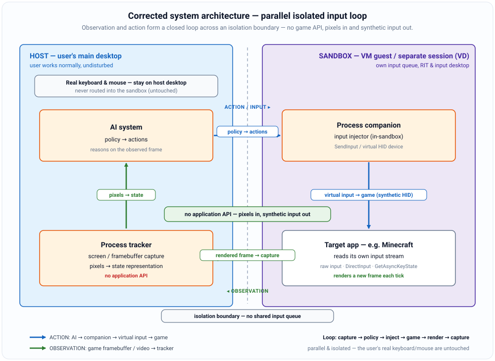
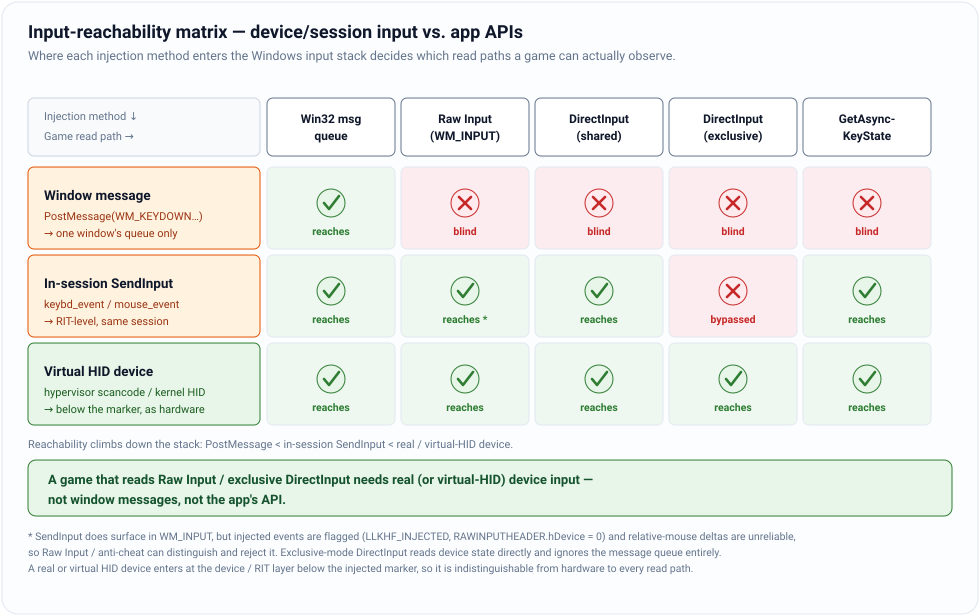
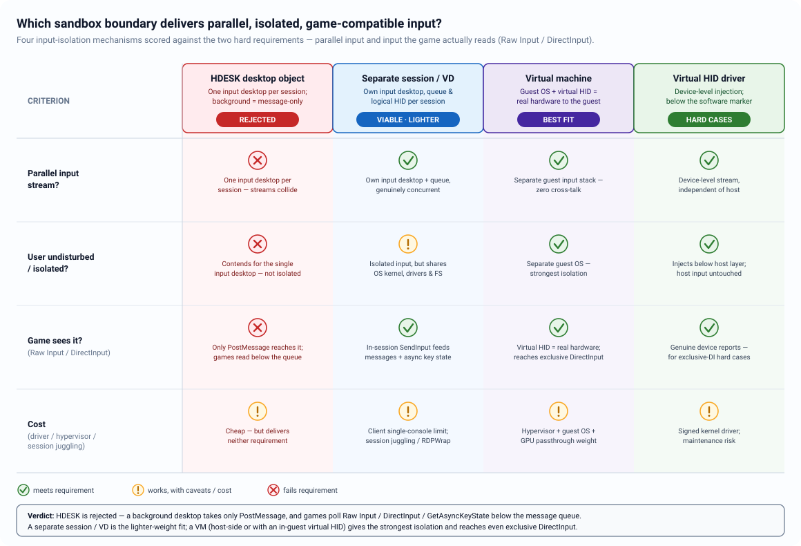
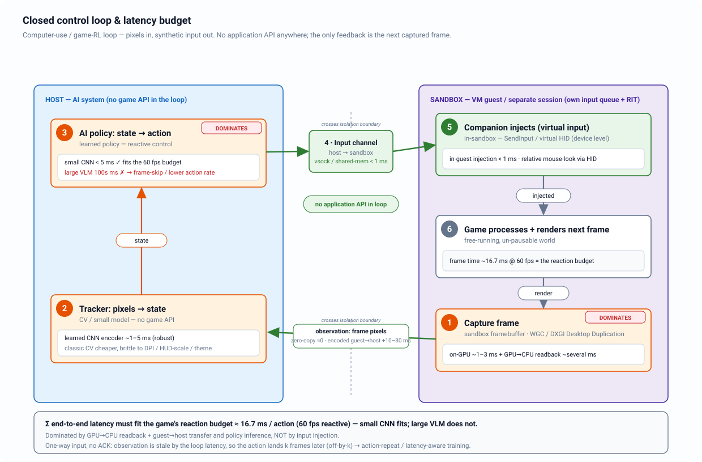

# Parallel Isolated Input Forwarding — Software Schematic

**Windows 11 · C++.** An AI agent on the user's **main desktop** drives an
interactive application (example: **Minecraft**) running inside an **isolated
sandbox** — a separate Windows session ("virtual desktop"/VD) or a **virtual
machine (VM)** — purely through a **parallel, synthetic input channel**, never
the application's APIs, mods, or memory. The user keeps working on the main
desktop **undisturbed**; the two input streams never collide.

This is a **design-only schematic**. Illustrative API/tool names appear where a
contract is load-bearing; they are not a finished implementation. Every
load-bearing claim was cross-checked against vendor documentation and
adversarially reviewed.

> **Supersedes the framing of** [`VIRTUAL-DESKTOP-INPUT-FORWARDING.md`](VIRTUAL-DESKTOP-INPUT-FORWARDING.md).
> That document analyzed Win32 **desktop objects (`HDESK`)**; §1 below explains
> why they are the *wrong* tool for this requirement (no parallel input; games
> read below the message queue). The HDESK document is retained as the detailed
> desktop-object reference.

Diagrams are hand-authored SVG (in [`diagrams/`](diagrams/)).

---

This design specifies a **parallel, isolated input channel** so that an AI agent on the user's main desktop can drive an interactive application (e.g. Minecraft) running inside a sandbox, **without touching the user's real keyboard/mouse** and in a way the **game actually receives**. The framing that matters is *where the two input streams diverge in the Windows/hypervisor stack* — not whether a desktop is "hidden" or "visible." A hidden desktop that renders offscreen looks like it is working while delivering no game-visible input; visibility is irrelevant, the **input-routing boundary** is everything.

Two hard requirements govern every choice below:

- **(R1) Isolation + parallelism** — the sandbox has its *own* input stream; the user's real devices are untouched and both run concurrently.
- **(R2) Game-received input** — the injected input reaches the paths a game actually reads (Raw Input, DirectInput, `GetAsyncKeyState`), not merely a window's message queue.

---

  

<b>Figure — architecture.</b> Corrected system architecture: the host (AI + process tracker) and the sandbox (game + process companion) form a closed observation/action loop across an isolation boundary — the user's real input is untouched.

---

## 1. Why a Win32 desktop object (HDESK) is the wrong tool

A Win32 **desktop object** (`CreateDesktopEx`/`HDESK`) is a GUI/security container, not an input-parallelism mechanism. Within one interactive session:

- There is exactly **one Raw Input Thread (RIT)** in win32k and, at any instant, exactly **one "input desktop."** Physical HID input and `SendInput` both route only to that current input desktop. `SwitchDesktop` is a full-screen, mutually-exclusive switch (the same primitive as the UAC secure desktop) — so two HDESKs cannot carry two live, parallel hardware-input streams. **R1 fails.**
- A background/non-input desktop receives **no hardware input and no `SendInput`** (injected input only reaches the session's *current* input desktop; `SetThreadDesktop` does not redirect it there). The *only* way to feed windows there is **message injection** (`PostMessage`/`SendMessage` of `WM_KEYDOWN`/`WM_CHAR`/`WM_LBUTTONDOWN`). But games read **below** the message queue — Raw Input (`WM_INPUT`), DirectInput/XInput device polling, and `GetAsyncKeyState`/`GetKeyState` — all of which are **blind to posted messages** (posting does not update the async key-state table). **R2 fails.**

What HDESK *is* legitimately good for — stated fairly — is (a) headless automation of **message-driven** line-of-business GUI apps via `PostMessage` without stealing the user's focus, and (b) a **USER-object security boundary** (a separate desktop is a separate window-message namespace, mitigating cross-process "shatter" attacks). Neither is our problem.

> **Also not the tool:** Windows 10/11 Task View "virtual desktops" (Win+Tab) are the *same* Default desktop object in the *same* session with the *same* single input queue — they help even less, and are unrelated to a VM.

---

## 2. Input-reachability reality

All physical HID events funnel through the kernel RIT, which fans out to three win32k-side consumers: **(a)** the per-thread posted-message queue, **(b)** the key-state tables, and **(c)** Raw Input clients (`WM_INPUT`). The decisive facts:

| Method | Enters at | Reaches messages | Reaches key-state | Reaches Raw Input as genuine device | Focus-gated | Detectable |
|---|---|---|---|---|---|---|
| `PostMessage(WM_*)` | one window's queue | one window only | no | no | no (can target background window) | trivially (not real input) |
| `SendInput`/`keybd_event`/`mouse_event` | RIT / input-desktop level | yes | **both** `GetKeyState` + `GetAsyncKeyState` | **no** — surfaces with `hDevice==NULL`, flagged `LLKHF_/LLMHF_INJECTED`, `GetCurrentInputMessageSource()==IMO_INJECTED` | yes (foreground of its session) | yes |
| Real / virtual **HID** device | below the RIT, in the device stack | yes | yes | **yes** (relative deltas, real device handle) | yes (guest/session foreground) | device *fingerprint* only |

So the reachability ranking (under the "drive a foreground game" scope) is:

**`PostMessage` (window messages) < in-session `SendInput` < real/virtual HID device.**

Two precise corrections that shape the architecture:

- `GetKeyState` (per-thread, message-synchronized) and `GetAsyncKeyState` (global, near-real-time) are **distinct tables**; `SendInput` moves both, `PostMessage` neither.
- **Modern DirectInput keyboard/mouse rides on Raw Input** and stays downstream of the RIT, so it *does* observe in-session `SendInput` — it is **not** a bypass. `PostMessage` is ineffective against DirectInput in *all* cooperative levels (not an exclusive-mode-specific property). The genuine upstream bypass is a **kernel/HID-direct read**, which sees nothing from `SendInput`.

**Minecraft / LWJGL3 + GLFW specifics.** Java Minecraft reads keyboard/menu/cursor-visible mouse through `WndProc` messages — fully driven by in-session `SendInput`. In-game **look-motion** depends on the "Raw Input" option:

- **Raw Input OFF** → GLFW uses cursor-warp + `WM_MOUSEMOVE` deltas → `SendInput` relative motion works.
- **Raw Input ON (the default where supported)** → GLFW registers via `RegisterRawInputDevices` and reads relative deltas from `WM_INPUT` → `SendInput` does **not** correctly produce these, so a **virtual/kernel HID injector is required** for look. Bedrock's GameInput/gamepad stack similarly needs a **virtual controller** (ViGEmBus-style), not `SendInput`.

  

<b>Figure — reachability.</b> Input-reachability matrix: window messages reach only a window's queue; in-session SendInput reaches the message queue, async key-state, and (flagged) Raw Input; a real/virtual HID device reaches everything, including exclusive DirectInput.

---

## 3. The two mechanisms that actually work

### 3a. Separate interactive Windows session ("virtual desktop" / VD)

Each interactive session owns its **own WinSta0, input desktop, RIT, and input queue**. A **companion process inside that session**, with its injecting thread attached to that session's input desktop, calls `SendInput` into the session's foreground game; the user's console-session input is never perturbed. Delivery is still **foreground-gated inside that session** and subject to **UIPI** (equal-or-lower integrity only).

**Constraints / weaknesses:**
- Client-SKU Windows permits **one active interactive session**; a second concurrent session requires unsupported enablement (RDPWrap / `termsrv.dll` byte-patch, re-broken by cumulative updates) — a licensing/ToS concern.
- A disconnected RDP session **locks to the secure desktop by default** and can stop GPU rendering → black capture. Keeping it live needs: `tscon RDP-Tcp#NN /dest:console`, disabled lock-on-disconnect and disconnect timeout GPOs, a **virtual display** (IddCx/IDD or dummy-plug) for a stable GPU framebuffer, and the **"Use hardware graphics adapters for all RDS sessions"** policy for real acceleration.
- Isolation is weaker than a VM: kernel, drivers, registry, filesystem are **shared** — a crash, kernel anti-cheat, or resource contention crosses into the host.
- `SendInput` still fails to feed raw-input relative mouselook → pair with an in-session **virtual HID** for exclusive-DirectInput / raw-look titles.

### 3b. Virtual machine (VM)

The guest is a **separate OS with its own kernel input stack**, so host and agent input never share a queue — the cleanest R1. Inject at the **device level**: a hypervisor synthetic HID, or an **in-guest kernel HID** driver. Such input enters below the software marker, carries **no injected flag**, and is seen as **genuine hardware** by Raw Input, DirectInput (incl. exclusive `Acquire`), and `GetAsyncKeyState` alike — the strongest R2.

**Two injection patterns:**
- **(A) Host-side hypervisor APIs** — VirtualBox `IKeyboard`/`VBoxManage controlvm <vm> keyboardputscancode` (keyboard has a CLI; **mouse does not** — use the `IMouse` COM API `putMouseEvent`/`putMouseEventAbsolute`), VMware VIX, Hyper-V synthetic keyboard. No guest agent, but coarser, higher-latency, and weak on relative-mouse/exclusive-DirectInput.
- **(B) In-guest companion** — receives actions over a VM-native channel and injects locally via `SendInput` (non-exclusive) and/or a guest kernel HID (ViGEmBus for pads; a custom HID minidriver for exclusive mouse/keyboard). Reaches exclusive-DirectInput titles and gives the lowest controllable latency, at the cost of guest-side driver setup.

**VM caveats:** absolute-coordinate virtual mice **break relative FPS mouselook** — present a **relative** pointing device (e.g. `IMouse::putMouseEvent` relative, or a guest virtual mouse HID); scancode injection is **layout/NumLock-sensitive** — use extended (`e0`-prefixed) codes to disambiguate keypad-vs-navigation (layout dependence of alphanumerics is inherent); a headless guest needs **GPU partitioning/passthrough** for accelerated rendering; the virtual **device is still fingerprintable** by kernel anti-cheat.

### Choosing

| Property | Separate session (VD) | VM |
|---|---|---|
| R1 isolation | task/UI + per-session input queue; shared kernel/FS | separate kernel + virtual HID; strongest |
| R2 exclusive/raw-mouse reach | needs virtual HID | native via device-level HID |
| Setup weight | light (but single-session/patch friction) | heavy (guest OS, GPU, drivers) |
| Capture latency | lower (shared GPU, no encode hop) | higher (capture+encode+transport) |
| Fault/security isolation | weak | strong |

**VM device-level injection is the most robust for both requirements; a second session is the lighter-weight alternative; same-session HDESK fails R1.**

  

<b>Figure — mechanisms.</b> Which sandbox boundary delivers parallel, isolated, game-compatible input — HDESK rejected; separate session (VD) viable and lighter; VM the strongest fit; virtual-HID for the hard exclusive-DirectInput cases.

---

## 4. Architecture split

A closed loop with a clean **host / sandbox** division and **no application API, mod, or memory access**:

**Host (user's main desktop):**
- **Process tracker** — captures the sandbox's video/state (Section 5), *observes only*, no app API.
- **AI system** — converts pixels → state → action decision.

**Sandbox (separate session or VM guest):**
- **Target application** (the game).
- **Process companion** — the injector that turns actions into real input via the reachability-appropriate method (Section 3).

**Two channels:**
1. **Observation channel** — sandbox frames → host tracker (in-guest capturer streamed out, or host-side capture of the sandbox window).
2. **Input channel** — host AI → sandbox companion → injected input.

**Closed loop:** `capture frame → tracker → AI → companion → inject input → game → render → capture …`

For a VM, prefer a **VM-native, no-open-port transport**: Hyper-V sockets (host `AF_HYPERV`/`HV_PROTOCOL_RAW` ↔ Windows-guest `AF_HYPERV`; Linux-guest `AF_VSOCK`), VMware **VMCI/vSockets**, or a shared-memory ring; a host-only TCP link is the fallback (it *does* open a port). Requires registering a service GUID and guest socket support — not zero-config.

  

<b>Figure — loop.</b> Closed control loop and latency budget: capture → tracker → AI policy → input channel → companion inject → game render → capture, dominated by GPU→CPU readback and inference, not by input injection.

---

## 5. Observation / capture without app APIs

Capture primitives are **isolation-bound** — this is the biggest fork between VD and VM:

- **DXGI Desktop Duplication (DDA)** — duplicates a whole **monitor** within the **caller's own session**; cannot reach across sessions from the host; needs an **active/connected, DWM-supported desktop** (black frames in locked/disconnected/secure-desktop states unless `LOCAL_SYSTEM`); caps at ~**4 concurrent** duplications/session. → For a VD sandbox, run the capturer **inside** that session and pipe frames out; you crop the window yourself.
- **Windows Graphics Capture (WGC)** — captures a **specific composited window's** GPU texture; works on hardware-accelerated/DirectX windows GDI can't, and captures **occluded** windows — but **not minimized** ones, and **exclusive-fullscreen bypasses DWM** (run the game **borderless-windowed**). Note the mandatory capture border on older builds and physical-pixel/DPI coordinate mapping.
- **GDI `BitBlt`/`PrintWindow`** — silently returns black/garbage on GPU-drawn or exclusive-fullscreen content; **fallback only** for pure-GDI UIs.
- **Hyper-V has no low-latency host framebuffer API** — the WMI thumbnail path is slow. A VM needs an **in-guest capturer** (WGC/DDA streamed out), a hypervisor **framebuffer callback** (VirtualBox `IFramebuffer`, VMware SDK), GPU passthrough, or **host-side WGC capture of the live VMConnect window**.

**Latency truth:** the dominant capture-side cost is the **GPU→CPU readback and cross-isolation transfer**, not on-GPU capture. Synchronous staging-texture `Map` stalls the pipeline several ms — use **double-buffered/async** readback or keep the observation resident on the GPU. An encoded guest→host codec (H.264/NVENC) adds latency *and* compression artifacts that corrupt template-matching/OCR; prefer **shared-memory zero-copy** or a lossless path when CV reliability matters.

**Pixels → state → input** is a demonstrated pattern for this exact game (OpenAI VPT / MineRL map frames → native keyboard+mouse), though those ran *inside* a Malmo mod — they validate the *policy*, not the OS-level injection layer, which must be proven separately. A learned CNN/transformer encoder is robust; classic CV (template match, HUD OCR, color thresholds) is cheaper but brittle to resolution/DPI/HUD-scale/theme changes. A single frame lacks velocity → **frame-stacking or a recurrent model** is required.

---

## 6. Isolation & parallelism guarantees (why the streams never collide)

The guarantee rests entirely on *where* the streams separate:

- **Same-session HDESK:** one RIT, one input desktop → physical and injected input **contend**. Rejected.
- **Separate session:** each session has its **own RIT/input queue**; the user's physical input (bound to the console session) and the companion's `SendInput` (bound to the sandbox session) are genuinely **independent and concurrent**. Injected input is confined to the sandbox session's queue and **never perturbs the console session** — but note that *within* a session injected input shares the stream with that session's real devices, which is exactly why the sandbox must be its **own** session.
- **VM:** the guest has an **entirely separate virtual HID stack**; injecting at hypervisor/device level never touches the host input subsystem at all — the cleanest separation.

In all working cases the game must still be the **foreground window inside the sandbox** (device/hypervisor injection removes *host* focus sensitivity, not *guest* focus).

---

## 7. Latency, synchronization, failure modes

The loop is a **soft-real-time pipeline with no in-band ACK** — the only feedback that an action registered is the **subsequent frame**. The AI acts on state stale by **(capture + inference + injection)** latency at the instant the action lands (render + next-capture latency is the additional delay before the *result* is observed). This **off-by-k staleness** is the defining constraint and must be modeled (action-repeat, latency-aware training, timestamp alignment).

**Budget:** ~16.7 ms/action is the per-action *throughput* budget for 60 fps play (not a hard latency ceiling — pipelining decouples the two); ~33 ms for 30 fps. Small CNN policies can hit it; large VLM policies (hundreds of ms) force frame-skip/action-repeat.

**Frame pacing** must be **event-driven** off present/frame-arrived signals — and **deduplicated**: WGC's `FrameArrived` fires on every DWM composition and re-delivers unchanged frames; DDA's `AcquireNextFrame` returns a timeout on no change. A free-running timer makes the policy re-process duplicates or act on stale frames.

**Structural failure modes:**
- **Silent foreground loss** (alt-tab, modal dialog, screensaver/lock) → injection lands on the wrong window (or is *blocked* on the secure desktop) while frames keep flowing → loop runs "open-loop blind." **Assert foreground every tick.**
- **Coordinate/DPI/resolution mismatch** → absolute mouse maps to the wrong pixel (primary-monitor-normalized 0–65535 absent `MOUSEEVENTF_VIRTUALDESK`; per-monitor DPI; guest resolution). **Pin resolution, disable DPI scaling, calibrate the transform once.**
- **Dropped/duplicated frames / loop stalls** → input desync; a stall with keys held must trigger a **key-release watchdog** fail-safe.
- **Weak-isolation bleed** (clipboard, global hotkeys) occurs only in the same-session case and when VM clipboard sharing is enabled — disable Guest Additions/Tools clipboard for a clean boundary.

**ToS / anti-cheat (transparency note, online play only):** synthetic input is flagged (`LLKHF_/LLMHF_INJECTED`, `hDevice==NULL`) and virtual HID / VM artifacts are fingerprintable; automating a networked title may breach that game's terms or trip kernel anti-cheat, which can enforce **locally at boot regardless of connectivity**. This is a compliance caveat, not something to engineer around. **The design is scoped to local/single-player / self-hosted RL,** where none of it applies. No evasion techniques are part of this analysis.

---

## 8. Explicitly excluded (out of scope)

- **Any use of the application's own APIs, mods, plugins, or process-memory reads/writes** — observation is pixels-only, input is synthetic-only.
- **Host-side injection reaching across the isolation boundary** — `SendInput` cannot cross a session, a different desktop object, or a VM guest; the injector must live *inside* the sandbox (or be a hypervisor virtual-HID channel).
- **Same-session HDESK / Task View "virtual desktops"** as an isolation mechanism.
- **Anti-cheat evasion, virtual-device spoofing, or ToS-circumvention techniques** for online play — noted only as a transparency caveat.
- **RDPWrap / `termsrv.dll` patching** treated as supported — it is unsupported and update-fragile; flagged, not recommended.
- **Building the control loop on Hyper-V's WMI/VMConnect thumbnail** as a real-time capture API.
- **Assuming `SendInput` alone suffices for raw-input mouselook or exclusive-DirectInput titles** — those require a virtual/kernel HID path.
