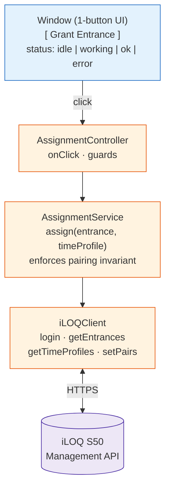
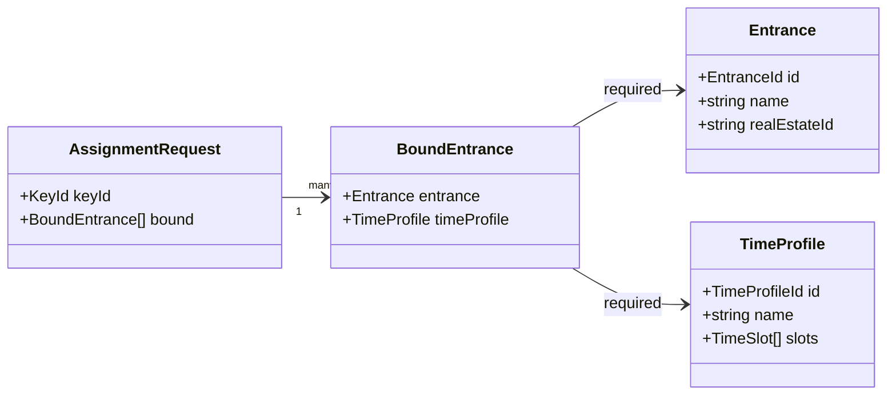
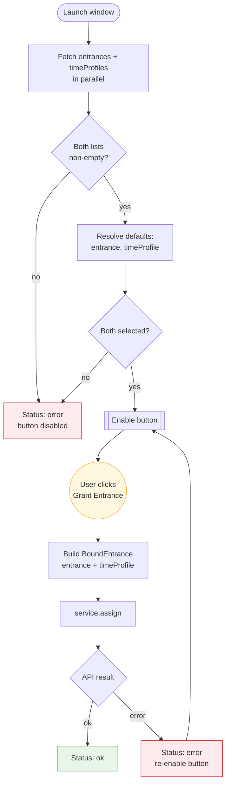
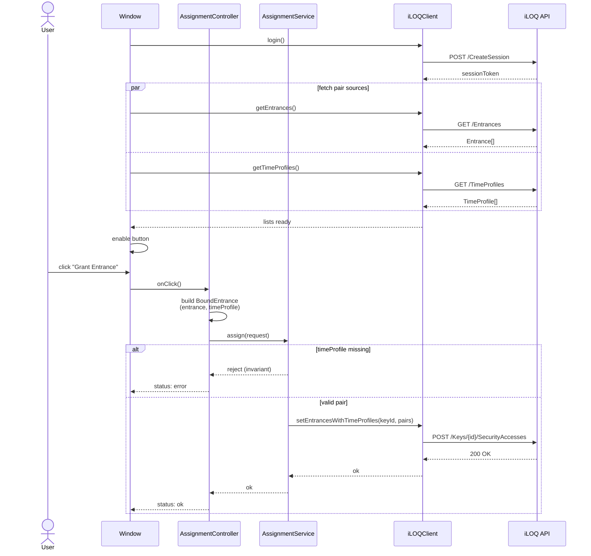
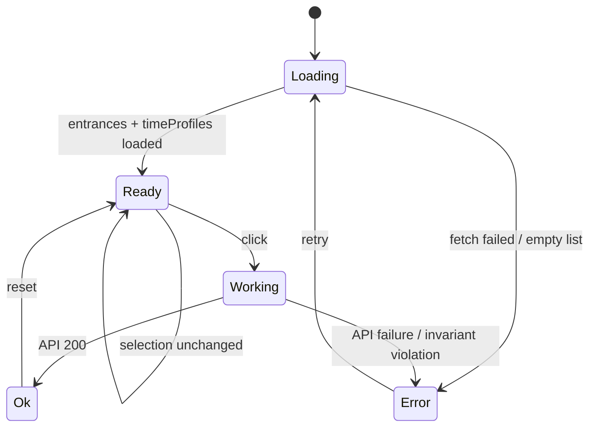

# Entrance + TimeProfile Binding — Software Schematic

TypeScript application integrating the iLOQ S50 Management API.
Scope: **one-button window** that assigns an `Entrance` to a key/token,
**always bound to a `TimeProfile`**. Assignment without a TimeProfile
is not representable in the type system and rejected at runtime.

This document is **design-only**. No implementation code.
Diagrams are written in GitHub-flavored Mermaid (```mermaid fenced blocks).

---

## 1. Component Layout



---

## 2. Domain Model



**Invariant (compile-time):** `BoundEntrance.timeProfile` is declared
non-optional. No constructor, factory, or code path produces a
`BoundEntrance` without an accompanying `TimeProfile`.

**Invariant (runtime):** `AssignmentService.assign` rejects any payload
whose `bound` array contains an item missing `timeProfile`, before the
iLOQ call is issued.

---

## 3. One-Button Window — UX Flow



Notes:
- The window has **one actionable control**: the button.
- Selections are resolved from config / sensible defaults, not user menus.
- Button is disabled until both sides of the pair are known.

---

## 4. Assignment Sequence (iLOQ API)



---

## 5. Button State Machine



---

## 6. iLOQ API Mapping

| Domain op                | iLOQ endpoint (conceptual)                       |
|--------------------------|--------------------------------------------------|
| authenticate             | `POST /api/v2/CreateSession`                     |
| list entrances           | `GET  /api/v2/Entrances`                         |
| list time profiles       | `GET  /api/v2/TimeProfiles`                      |
| assign paired to a key   | `POST /api/v2/Keys/{keyId}/SecurityAccesses`     |

Each payload item sent to `SecurityAccesses` must carry both
`EntranceId` and `TimeProfileId`. The client refuses to serialize an
item that lacks either.

---

## 7. Failure Modes

| Case                                  | Handling                                |
|---------------------------------------|-----------------------------------------|
| entrance list empty                   | button stays disabled, status err       |
| timeProfile list empty                | button stays disabled, status err       |
| auth / network failure                | status err, button re-enabled           |
| server rejects pairing                | status err with server message          |
| caller attempts bypass (no profile)   | type error at compile; throw at runtime |

---

## 8. What this schematic deliberately excludes

- Multi-select UI, grids, search.
- Entrance management without a time profile — not supported by design.
- Key creation, person management, hardware programming flows.
- Persistence beyond the in-memory session token.
