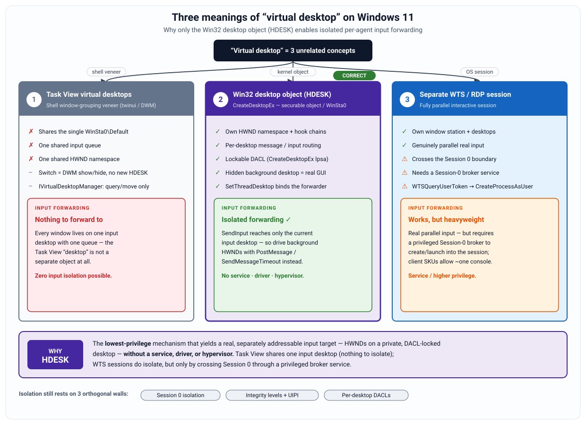
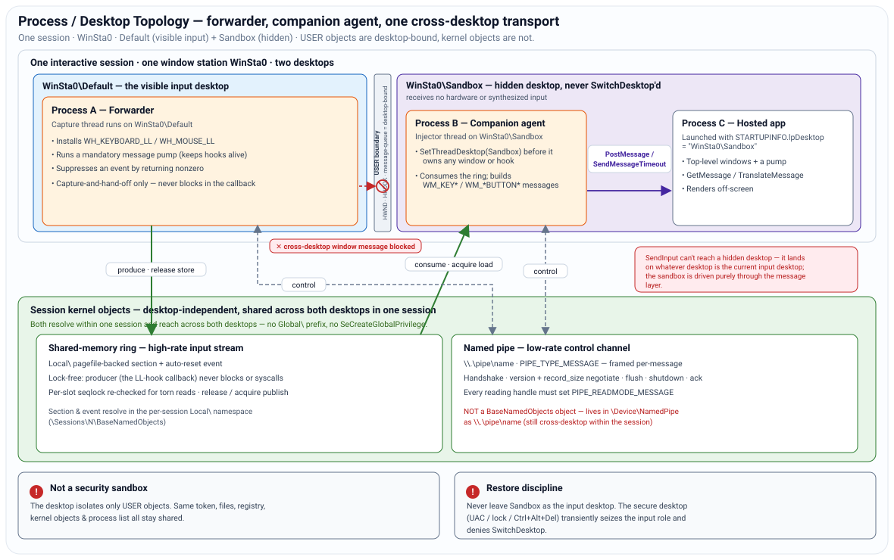
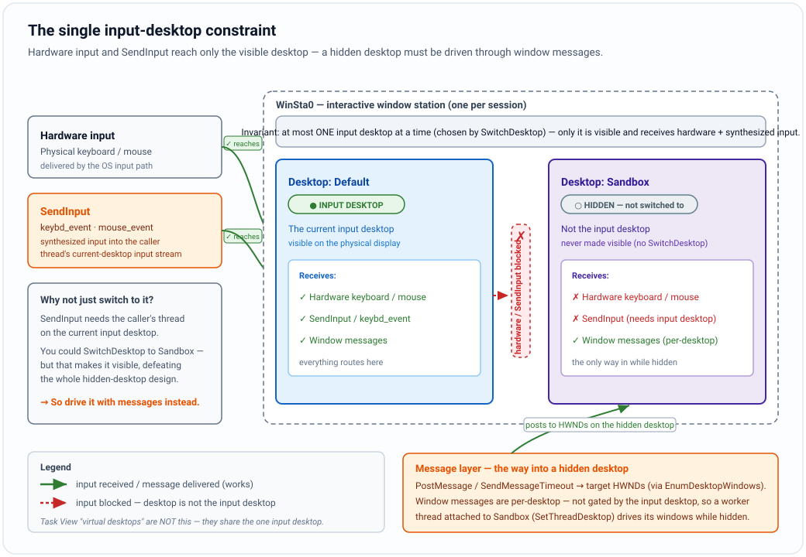
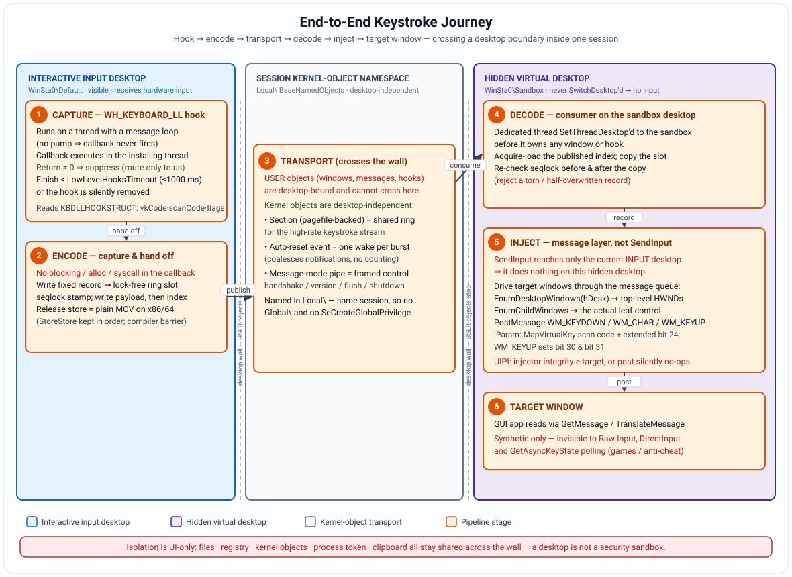
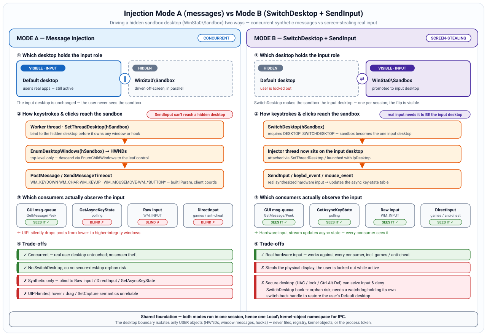
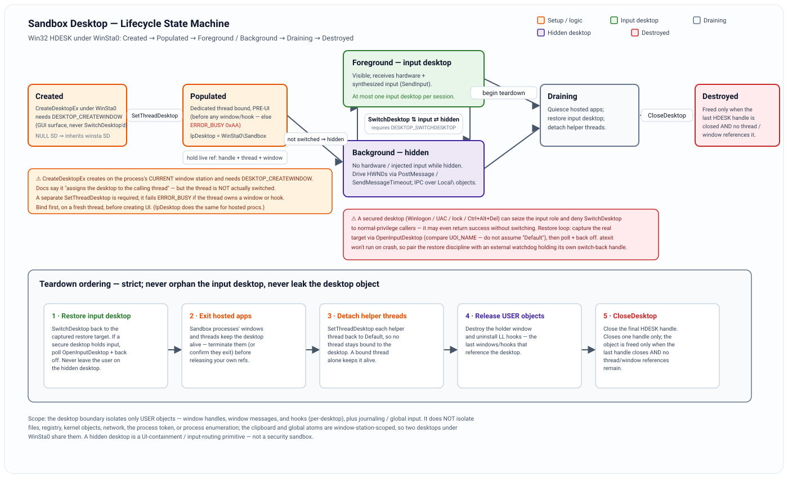

# Virtual Desktop Creation + Input Forwarding — Software Schematic

**Windows 11 · C++.** A *forwarder* process creates an isolated Win32 desktop
object (`HDESK`) under the interactive window station and captures user input;
a *companion agent* process running inside that hidden desktop replays the
forwarded input against the windows hosted there.

This is a **design-only schematic**. Illustrative C signatures appear where a
contract is load-bearing; they are not a finished implementation. Every
API-level claim below was cross-checked against Microsoft documentation and
adversarially reviewed; corrections to the naive mental model are flagged
inline with ⚠.

Diagrams are hand-authored SVG (in [`diagrams/`](diagrams/)).

---

## 1. Purpose and scope

This document specifies the design of a Windows 11 (C++) subsystem that (a) creates an **isolated GUI desktop** using the Win32 desktop-object (`HDESK`) model under the interactive window station `WinSta0`, and (b) runs a **companion agent** inside that desktop which receives input forwarded from the user's real interactive desktop and replays it against windows living on the sandbox desktop.

It is a **design-only schematic**. Illustrative C signatures appear where a contract is load-bearing; they are not a finished implementation.

The single most important framing, stated up front so the rest of the design reads correctly:

> An `HDESK` is a **UI-containment and input-routing primitive, not a security sandbox.** The desktop boundary isolates USER objects — window handles, window-message routing, and hooks — and nothing else. Files, registry, kernel objects, the process token, the network, and the process list are fully shared with everything else in the session. Where this document says "isolated," it means *window/message/hook isolation*, never kernel- or token-level containment. A real sandbox additionally requires a restricted/AppContainer token plus a job object; those are out of scope (see §13, Excludes).

---

## 2. The three meanings of "virtual desktop," and why HDESK

<p align="center">
  
</p>

<p align="center"><sub><b>Figure — taxonomy.</b> The three meanings of "virtual desktop" on Windows 11, and why the Win32 desktop object (HDESK) is the only one that supports isolated input forwarding.</sub></p>

On Windows 11 the phrase "virtual desktop" collapses three unrelated concepts operating at different layers:

| Concept | Layer | Own input queue? | Own HWND namespace? | Needs privilege/broker? | Verdict for this design |
|---|---|---|---|---|---|
| **Task View virtual desktops** | Shell (DWM cloaking) | No — shares the one `WinSta0\Default` | No — one shared namespace | No | **Rejected.** Pure show/hide veneer; provides zero input isolation and exposes nothing separate to forward input to. |
| **Win32 desktop object (`HDESK`)** | Kernel USER (win32k), securable | Effectively yes — desktop-scoped message routing / hook chains / input isolation | Yes — per-desktop window namespace | No (same station, same session) | **Chosen.** Lowest-privilege mechanism yielding a real, separately addressable target for input, with no service, driver, or hypervisor. |
| **Separate WTS/RDP session** | Session Manager | Yes, fully parallel | Yes | Yes — a Session-0 service must broker session creation and cross Session 0 isolation | **Rejected** (for this design's constraints). Heavyweight; requires a privileged broker; client SKUs allow only one active console session. |

**Task View precision.** Task View virtual desktops are a shell-level grouping of top-level windows that all live on the single interactive `WinSta0\Default` desktop and share its input queue and HWND namespace. Switching a Task View desktop **cloaks/uncloaks** windows via DWM shell cloaking (`DWMWA_CLOAKED == DWM_CLOAKED_SHELL`); a cloaked window keeps `WS_VISIBLE`, still receives `WM_PAINT`, and remains enumerable by `EnumWindows` — which is precisely why there is a single window namespace and nothing to isolate. The **public** `IVirtualDesktopManager` (`CLSID_VirtualDesktopManager`, `shobjidl_core.h`) exposes only `GetWindowDesktopId`, `IsWindowOnCurrentVirtualDesktop`, and `MoveWindowToDesktop`; it cannot create, switch, or delete desktops. Those operations require the **undocumented** `IVirtualDesktopManagerInternal`, whose interface GUIDs and method layouts drift across builds — do **not** bind to it by IID in a shipping design.

**Why HDESK.** It is the only one of the three that yields a genuine, separately addressable window/message/hook namespace **without** a service, a driver, or a hypervisor, and without leaving the current session.

---

## 3. Desktop creation and window stations

<p align="center">
  
</p>

<p align="center"><sub><b>Figure — topology.</b> Process / desktop topology: a forwarder on the visible desktop, a companion agent on the hidden desktop, and a cross-desktop kernel-object transport.</sub></p>

### 3.1 Object model

A **window station** is a session-scoped container that owns a clipboard, a global atom table, and a set of desktops. A **desktop** is a USER container owning a namespace of window handles, hooks, menus, and per-desktop message routing.

Critical corrections to the naive mental model:

- **`WinSta0` is a per-session name, not a global object.** Every console and RDP session has its own interactive `WinSta0`, and several can be interactive simultaneously. Conversely, **Session 0's `WinSta0` is headless** (non-interactive) after Session 0 Isolation. This design targets *the interactive `WinSta0` of the target user session*.
- **Only the interactive `WinSta0` can reach physical (or remote-virtualized) display/input.** A non-interactive station (e.g. `Service-0x0-3e7$`) can still host desktops where GUI apps create windows, pump messages, and render **off-screen**, drivable by window messages. Because Mode B (§7) needs `SwitchDesktop` to the physical console, **the sandbox desktop must live under the interactive `WinSta0`**, not a service station.
- The **clipboard and global atom table are window-station scoped, not desktop scoped.** Two desktops under one `WinSta0` share one clipboard — a sandbox app can read/inject the user's clipboard. Isolating that would require a separate (UI-incapable) station, an inherent trade-off we accept.

### 3.2 Creation call

```c
HDESK CreateDesktopEx(
    LPCWSTR             lpszDesktop,      // "Sandbox"
    LPCWSTR             lpszDevice,       // NULL
    DEVMODEW*           pDevmode,         // NULL
    DWORD               dwFlags,          // 0
    ACCESS_MASK         dwDesiredAccess,  // must include DESKTOP_CREATEWINDOW
    LPSECURITY_ATTRIBUTES lpsa,           // desktop DACL (see §8)
    ULONG               ulHeapSize);      // desktop heap KB (see §10)
```

Structural semantics, with the one documented-but-misleading clause corrected:

- **No window-station parameter exists.** The desktop is created in the **calling process's current window station**; to create it elsewhere you must `SetProcessWindowStation` first. The process must already have an associated window station.
- **`dwDesiredAccess` must include `DESKTOP_CREATEWINDOW`** — the call internally creates a window. (If you request `READ_CONTROL`/`WRITE_DAC`/`WRITE_OWNER`, also request `DESKTOP_READOBJECTS` and `DESKTOP_WRITEOBJECTS`.)
- **⚠ The docs say `CreateDesktopEx` "assigns the new desktop to the calling thread." At runtime it does not switch the running thread.** The thread remains on its inherited/current desktop; a separate `SetThreadDesktop` is required to actually place a thread on the new desktop — and that call fails (`ERROR_BUSY`) if the thread owns any window or hook. Treat creation and thread-placement as two steps.

### 3.3 Thread placement

```c
BOOL SetThreadDesktop(HDESK hDesktop);
```

- Fails if the calling thread has any **windows or hooks** on its current desktop (unless `hDesktop` is the current desktop). Message queues are **not** a documented blocker.
- The target desktop must belong to the process's **current window station**.
- **Therefore: perform the switch on a fresh, dedicated worker thread before it creates any window or installs any hook.** A thread's desktop connection is otherwise established lazily on its first USER/GDI call, inheriting from the parent process, `STARTUPINFO.lpDesktop`, or the station default.

### 3.4 Launching hosted apps

- `STARTUPINFO.lpDesktop = L"WinSta0\\Sandbox"` — a backslash means *station\desktop*.
- **Connection precedence** (this overrides the naive "NULL inherits parent" belief): (1) a `SetThreadDesktop` desktop wins; (2) else the desktop from an **inherited, inheritable `HDESK`** in the process handle table; (3) only then is `lpDesktop` consulted, and if it is NULL in that case the thread connects to the **window station's default desktop** (a fixed default).
- **Launch the target EXE directly.** Shell/COM/broker-mediated launches (`explorer`, `ShellExecute`, protocol handlers) are spawned by an existing broker bound to another desktop and **ignore `lpDesktop`**.
- Hold a **live reference** — an open `HDESK`, plus a thread assigned to the desktop, plus a window — for the desktop's lifetime (§9).

---

## 4. The single input-desktop constraint (the crux)

<p align="center">
  
</p>

<p align="center"><sub><b>Figure — input-desktop.</b> The single input-desktop constraint: hardware input and SendInput reach only the visible desktop, so a hidden desktop must be driven through window messages.</sub></p>

This is the invariant the whole architecture bends around.

- On the interactive `WinSta0`, **multiple desktops can each be capable of UI/input, but at most one is the *input desktop*** at any instant: the one designated to receive user input (and, when the session is connected to a console, the one displayed). This designated role persists even with no viewing user — a disconnected RDP session or isolated Session 0 still has one.
- **`SwitchDesktop(hDesktop)`** selects which desktop holds that role. It requires `DESKTOP_SWITCHDESKTOP` **on the target desktop**, the target must be on the process's current window station, and it fails for an invisible station, a cross-session desktop, or a caller associated with a secured desktop. **⚠ A nonzero (success) return does not guarantee the switch took effect** — on a locked workstation (Win10/11 LogonUI active) it can return success while the secure desktop keeps input. Always verify by re-reading the input desktop.
- **`OpenInputDesktop`** returns a handle to the current input desktop — **on success only.** When the secure/Winlogon desktop is active (lock, logon, UAC), a normal-privilege call **fails with NULL/`ERROR_ACCESS_DENIED`**. This is the canonical lock-detection idiom and a load-bearing signal for the restore discipline.
- **⚠ Attaching a thread with `SetThreadDesktop` is NOT the same as making that desktop the input desktop.** `SetThreadDesktop` only scopes which HWNDs the thread can create/find and where its synthesized input lands; it never changes the input desktop.

**The consequence that forks the entire design.** Synthesized input from `SendInput`/`keybd_event`/`mouse_event` is inserted into the input queue of the desktop the **calling thread is connected to**, and only the current input desktop is visible and receives it. A hidden, non-input desktop therefore receives neither hardware nor (usefully) synthesized input while it stays hidden. You have exactly two ways to drive it:

- **Mode A — message injection** into the hidden desktop's windows (§6), never showing it.
- **Mode B — `SwitchDesktop` to it, then `SendInput`** on the current input desktop (§7).

> Note on a common myth: injecting from a thread bound to a non-input desktop does **not** "fail with `ERROR_ACCESS_DENIED (5)`." `SendInput` returns 0 only when input was already blocked by another thread; UIPI failures are invisible to the return value and `GetLastError`; `keybd_event`/`mouse_event` return `void`. There is no documented access-denied path tied to desktop attachment — the input simply lands on a queue nobody is watching.

The secure desktop's transient seizure of the input-desktop role — and its denial of `SwitchDesktop` to normal processes — is what drives the **restore/never-orphan discipline** that is the crux of any background-desktop design (§9, §11).

---

## 5. Input capture (on the user's real desktop)

The forwarder runs on the user's interactive desktop and captures the input to be forwarded.

### 5.1 Low-level hooks — the suppression path

`WH_KEYBOARD_LL` / `WH_MOUSE_LL` are the only user-mode mechanism that can both **observe and suppress** keyboard/mouse input desktop-wide (enabling "route only to the sandbox" designs).

```c
HHOOK SetWindowsHookExW(WH_KEYBOARD_LL, LowLevelKeyboardProc,
                        GetModuleHandleW(NULL), 0);
```

Hard constraints, honoring the corrections:

- The callback **runs in the context of the installing thread**, delivered via an internal message. That thread must run a **message pump** (any retrieval call — `GetMessage`/`PeekMessage`/`MsgWaitForMultipleObjects` — not specifically `DispatchMessage`) or the hook never fires.
- **`hMod` is not NULL.** The procedure need not live in an injected DLL, but pass a valid module handle (`GetModuleHandle(NULL)`); these are global hooks (`dwThreadId=0`) and NULL `hMod` with `dwThreadId=0` may error.
- **Return-to-suppress:** when `nCode >= 0`, returning nonzero drops the event; otherwise call `CallNextHookEx` and return its value. Suppression must be **symmetric across the down/up pair** or downstream apps get a stuck key.
- **Timeout, corrected:** exceeding `LowLevelHooksTimeout` causes the event to pass through **and** (Win7+) can **silently remove** the hook with no notification (Win7-era guidance: ~10 tolerated timeouts, unhook on the 11th; exact counter undocumented). Win10 1709+ **hard-caps** the effective timeout at 1000 ms (larger registry values clamped) and lowered the default to 1000 ms. The oft-quoted "300 ms default" is folklore. **The callback must never block, allocate under a contended lock, or make a blocking syscall** — capture-and-hand-off only (§6 ring).
- **Desktop-bound:** the hook sees only its installing thread's desktop, and is blind on the secure/UAC/lock desktop. Integrity/UIPI: a medium-IL hook receives nothing while a higher-IL window has focus.
- **Re-injection feedback:** everyone's injected events set `LLKHF_INJECTED`; tag your own re-injection with a sentinel in `dwExtraInfo` and skip it in the callback to avoid loops.
- **Field caveats:** the `flags` bitfield is exact (`LLKHF_EXTENDED 0x01`, `LLKHF_LOWER_IL_INJECTED 0x02` co-sets bit 4, `LLKHF_INJECTED 0x10`, `LLKHF_ALTDOWN 0x20`, `LLKHF_UP 0x80`); `vkCode` is documented 1..254 but **injected `KEYEVENTF_UNICODE`/`VK_PACKET` yields `vkCode=0` — tolerate it**; `scanCode` is a real hardware scan code only for hardware events. Do not call `GetAsyncKeyState` inside the callback to read the just-changed key — async state is not yet updated.

### 5.2 Raw Input — the monitoring path

`RegisterRawInputDevices` + `WM_INPUT` + `GetRawInputData` sees keyboard/mouse without focus via `RIDEV_INPUTSINK` (which **requires a valid non-NULL `hwndTarget`**) and gives clean per-device scan-code data. It **cannot act as a system-wide veto** the way an LL hook can. It is not, however, purely read-only: `RIDEV_NOLEGACY` makes the system stop generating legacy `WM_KEYDOWN`/`WM_CHAR`/`WM_*BUTTON*` for **the registering application only** (and `RIDEV_NOHOTKEYS`/`RIDEV_CAPTUREMOUSE` further alter handling). It cannot suppress another process's input.

### 5.3 Choice

Choose **LL hooks when suppression is required** (route-only-to-sandbox). Choose **Raw Input when you only need to monitor** and want to avoid the timeout/latency liability. The two compose: Raw Input for clean per-device monitoring, LL hooks for the suppression gate.

---

## 6. IPC transport (crossing the desktop boundary)

The decisive constraint: **window messages and hooks are desktop-bound** — per Microsoft's *Desktops* doc, "window messages can be sent only between processes that are on the same desktop." A message/`SendMessage`-based channel therefore cannot serve as the forwarder→agent transport across `Default`→`Sandbox`. **Kernel objects are not desktop-bound**, so the transport is kernel objects.

**Namespace fact:** named events, mutexes, semaphores, waitable timers, file-mappings, and job objects resolve in the **per-session** `\Sessions\<n>\BaseNamedObjects` (the `Local\` prefix, or the default for unqualified names), independent of desktop/window station. Two threads in the same session on different desktops open the same `Local\`-named object with **no elevation and no `Global\`/`SeCreateGlobalPrivilege`**. Do **not** use `Global\` — it widens exposure to other sessions and adds a privilege requirement. (Named pipes are the one outlier: they live in the machine-wide `\Device\NamedPipe` as `\\.\pipe\name`, not in BNO — they still work cross-desktop same-session.)

### 6.1 Recommended split

| Channel | Object(s) | Carries | Why |
|---|---|---|---|
| **High-rate input stream** | Pagefile-backed section (`hFile = INVALID_HANDLE_VALUE`) + auto-reset event | LL-hook capture records | Producer runs in the hook callback and **must never block or syscall** — a lock-free shared-memory ring plus a single wakeup event is the only path that respects the LL-hook timeout. |
| **Low-rate control channel** | Message-mode named pipe (`PIPE_TYPE_MESSAGE\|PIPE_READMODE_MESSAGE`) | Handshake, version/`record_size` negotiation, flush, shutdown, ack | Preserves message boundaries → built-in framing for discrete commands. |

### 6.2 Shared-memory ring discipline

- **Coherence:** multiple mapped views of one pagefile-backed section alias the same physical pages, so a store through one view is visible through another **without `FlushViewOfFile`** (which only pushes dirty pages to a *file*-backed section — wasted work here).
- **Publication ordering:** on x86/x64, for ordinary MOV loads/stores to normal **write-back cacheable** memory, the only hardware reordering is StoreLoad; StoreStore/LoadLoad are preserved. A payload-then-index **release store** compiles to a plain MOV — no locked instruction, no `MFENCE`. **⚠ Caveat:** this does *not* hold for non-temporal/streaming stores, write-combining memory, or `REP MOVS`/`STOS` — which a large-payload `memcpy` may use internally; if the payload copy takes a non-temporal path, insert an `SFENCE` before publishing the index. On ARM64 you need real acquire/release fences regardless.
- **Torn-read protection:** a lossy overwriting ring needs a **per-slot seqlock stamp** re-checked after the copy — validate `seq` before and after; retry on mismatch.
- **Wakeup coalescing:** an **auto-reset** event releases exactly one waiter and collapses a burst of `SetEvent` calls into one wake (desired). Do not swap to manual-reset casually. Guard the **lost-wakeup race**: consumer publishes a "parked" flag, then re-checks non-empty before waiting; keep a finite wait timeout as backstop.
- **Cross-integrity:** if the agent runs at a different integrity level, `sa=NULL` is insufficient — provide an explicit **DACL + mandatory-integrity SACL** on section/event/pipe or the low-IL side gets `ERROR_ACCESS_DENIED`.
- **Versioning:** negotiate `record_size`/`version` over the pipe; validate a header magic/version/size on open and fail loudly through the control channel rather than hard-coding.

---

<p align="center">
  
</p>

<p align="center"><sub><b>Figure — sequence.</b> End-to-end keystroke journey: capture → encode → kernel-object transport → decode → message injection → target window, crossing one desktop boundary inside a session.</sub></p>

---

## 7. Message injection (Mode A) vs SwitchDesktop + SendInput (Mode B)

<p align="center">
  
</p>

<p align="center"><sub><b>Figure — injection-modes.</b> Injection Mode A (synthetic window messages, concurrent) vs Mode B (SwitchDesktop + SendInput, screen-stealing but faithful).</sub></p>

The agent turns forwarded records into input against sandbox windows using one of two modes.

### 7.1 Mode A — synthetic window messages (desktop stays hidden)

Resolve targets with `EnumDesktopWindows(hSandboxDesk, …)` — which returns **only top-level windows**; **descend with `EnumChildWindows`/`FindWindowEx`** to the actual leaf control. Drive them with `PostMessage`/`SendMessageTimeout` carrying hand-built `WM_KEYDOWN`/`WM_CHAR`/`WM_KEYUP` and `WM_MOUSEMOVE`/`WM_*BUTTON*`.

Because messages cannot cross desktops, **the injecting thread must be connected (`SetThreadDesktop`) to the sandbox desktop**; merely holding the HWND from another desktop is not a supported operation.

Message-construction rules:

- **Keyboard `lParam`:** bits 0–15 repeat, 16–23 OEM scan code, 24 extended, 29 context, 30 previous state, 31 transition. `WM_KEYDOWN` sets bit31=0 and (first press) bit30=0; `WM_KEYUP` must set bit30=1 **and** bit31=1. Get the scan code via `MapVirtualKey(vk, MAPVK_VK_TO_VSC)` — but **⚠ it strips the extended bit** for the nav cluster / numpad-shared keys and `VK_RETURN`, so set bit 24 yourself (or use `MAPVK_VK_TO_VSC_EX`, Vista+). Extended-ness follows the *physical* key, not the VK. Pairing is not guaranteed (`VK_SNAPSHOT` yields only `WM_KEYUP`).
- **`WM_KEYDOWN` does not auto-generate `WM_CHAR`** — that comes from the target's own `TranslateMessage`. For reliable text, **post `WM_CHAR` directly.** Note `SendMessage` bypasses the queue entirely (calls the wndproc directly), so a *sent* `WM_KEYDOWN` is never `TranslateMessage`'d — another reason to post `WM_CHAR`.
- **Mouse coordinates:** `WM_MOUSEMOVE` and **all** `WM_*BUTTON*` (including `WM_XBUTTON*`) carry x/y in **client** coordinates (low/high word of `lParam`); **only `WM_MOUSEWHEEL`/`WM_MOUSEHWHEEL` use screen** coordinates. `wParam` is the `MK_*` held-button/modifier bitmask. Convert with `ScreenToClient`, unpack with `GET_X_LPARAM`/`GET_Y_LPARAM` (signed).
- **Timeouts:** plain `SendMessage` has **no timeout** and blocks indefinitely against a non-pumping target; use `SendMessageTimeout` with `SMTO_ABORTIFHUNG` and a bounded timeout, or `PostMessage`.

### 7.2 Mode B — `SwitchDesktop` then `SendInput`

Make the sandbox the input desktop, attach the injector thread to it, `SendInput` real hardware-level input, then **restore**. This drives even apps that ignore the message layer — but it makes the sandbox **visible** during the window and is subject to the secure-desktop hazard on restore (§9).

### 7.3 Honest limits table

| Property | Mode A (messages) | Mode B (`SwitchDesktop`+`SendInput`) |
|---|---|---|
| Desktop stays hidden | **Yes** | No — sandbox becomes visible during injection |
| Updates async hardware key/button state (`GetAsyncKeyState`) | **No** | Yes |
| Seen by Raw Input / `WM_INPUT` | **No** | Yes |
| Seen by DirectInput | **No** | Yes |
| Works for games / anti-cheat / polling apps | **No** | Yes |
| Blocked silently by UIPI (lower→higher IL) | Yes (post "succeeds", dropped) | Yes (injected input dropped, no error) |
| Hover / `SetCapture` / drag hit-test fidelity | Poor — skips `DefWindowProc` machinery | Full |
| Requires thread on the target desktop | Yes (`SetThreadDesktop` to sandbox) | Yes (attached to the now-input desktop) |
| Reliability hazard | Non-pumping target → hang (mitigate with `SendMessageTimeout`) | Secure desktop denies/soft-fails the switch; **orphan risk** on crash |
| Coordinate/DPI sensitivity | High (client coords, DPI) | High (screen coords, DPI, cursor placement) |

**Neither mode is a superset.** Mode A is invisible and cheap but purely synthetic — invisible to `GetAsyncKeyState`/Raw Input/DirectInput, so it fundamentally cannot drive games/anti-cheat. Mode B is faithful but visible, latency-coupled to desktop switching, and carries the orphan hazard. `AttachThreadInput` can partially bridge focus/`GetKeyState` for Mode A but **never** makes `GetAsyncKeyState` reflect injected keys, and must not be left permanently attached (deadlock/serialization risk; meaningless across desktops).

---

## 8. Security model (three orthogonal walls)

The design's containment rests on three **orthogonal** mechanisms; none substitutes for another.

1. **Session 0 isolation.** A Session-0 service cannot open or render on a user's `WinSta0\Default`, and cannot `CreateDesktop` its way onto the user's station. If any component must run as a service, it reaches the user session only via `WTSQueryUserToken` + `CreateProcessAsUser` (with `STARTUPINFO.lpDesktop`). WTS APIs do **not** create interactive sessions; `SERVICE_INTERACTIVE_PROCESS` + `UI0Detect` was removed in Win10 1803 and is absent on Win11.

2. **Integrity levels + UIPI.** UIPI (via Mandatory Integrity Control, enforced **independently of the desktop DACL**) blocks a lower-integrity process from posting/sending messages, installing hooks, or injecting into a higher-integrity window **on the same desktop**. A lower→higher post "succeeds" and is silently dropped. To receive such a message the **higher**-integrity receiver must call `ChangeWindowMessageFilterEx(hwnd, msg, MSGFLT_ALLOW, …)` on its own window; the low-IL injector cannot lower another process's filter, and processes at/below Low IL that call it fail with `ERROR_ACCESS_DENIED`. Caveats: some sub-`WM_USER` messages always pass; a `uiAccess=true` (signed, secure-location) app bypasses UIPI entirely. **Practical rule: the forwarder/agent must be at an integrity level ≥ the sandbox targets, or injection silently no-ops.**

3. **Per-desktop DACL.** `CreateDesktopEx`'s `LPSECURITY_ATTRIBUTES` sets the desktop DACL; desktop access is gated by `DESKTOP_CREATEWINDOW`, `DESKTOP_WRITEOBJECTS`, `DESKTOP_READOBJECTS`, `DESKTOP_HOOKCONTROL`, `DESKTOP_JOURNALPLAYBACK`/`RECORD`, `DESKTOP_SWITCHDESKTOP`. Lock the sandbox desktop so only the forwarder's token may create windows or install hooks; **deny `DESKTOP_SWITCHDESKTOP` and `DESKTOP_JOURNAL*` to hosted apps** so a compromised sandbox app cannot yank itself to the input desktop or replay journal input. Caveats: a **NULL** descriptor **inherits the parent window station's SD**, not a fixed default — set an explicit one. `DESKTOP_JOURNAL*` is a weak lever (Vista+ UIPI already blocks journal hooks for non-`uiAccess` processes regardless of DACL). The DACL does **not** bound integrity/UIPI, a privileged token's `WRITE_DAC`/`SeDebugPrivilege` override, the single-input-desktop rule, or RawInput/DirectInput capture.

> Restated: the desktop DACL is **necessary but not sufficient**. Because the token, files, registry, and kernel objects are shared, a hosted app that is not additionally confined by a restricted/AppContainer token + job object is not sandboxed in any security sense.

---

## 9. Lifecycle and teardown ordering

<p align="center">
  
</p>

<p align="center"><sub><b>Figure — lifecycle.</b> Sandbox-desktop lifecycle state machine and the strict, reverse-order teardown that never orphans the input desktop.</sub></p>

A desktop object stays alive while **any** of these hold: an open `HDESK` handle, a thread assigned to it, or a resident window/menu/hook. `CloseDesktop` closes **one handle** and does nothing toward destruction while other references remain.

**⚠ `CloseDesktop`'s documented failure conditions are narrow:** it fails only if a thread **in the calling process** is using that specific handle, or the handle is the calling process's initial desktop. It does **not** fail merely because a window or another process's thread references the desktop — in the cross-process case it **succeeds but the desktop persists** via the other references. (The window/hook restriction people misattribute here actually belongs to `SetThreadDesktop`.)

**Teardown ordering (reverse of creation):**

1. Signal hosted processes to exit through the control pipe; wait for them; force-terminate stragglers. Orphan windows/processes keep the desktop (and its desktop heap) alive.
2. Uninstall hooks; destroy windows owned by helper threads.
3. Switch every helper thread **back to `Default`** (`SetThreadDesktop`) so no thread remains assigned to the sandbox.
4. `CloseDesktop` all handles.
5. Only after the last handle closes and no thread/window/hook references it does the desktop object free (and its desktop heap return).

`atexit` does **not** run on crash — teardown and (for Mode B) input-desktop restore must be **SEH/RAII-guarded**, backed by an **external watchdog** holding its own switch-back handle to `Default` (§11).

---

## 10. Failure modes and resource limits

| Failure mode | Cause | Mitigation |
|---|---|---|
| `SetThreadDesktop` fails (`ERROR_BUSY`) | Thread already owns a window/hook | Switch on a fresh dedicated thread before any USER object exists |
| `CreateDesktopEx` fails | `DESKTOP_CREATEWINDOW` omitted; desktop-heap exhaustion | Include the right; size/monitor heap |
| Desktop-heap exhaustion | Default `ulHeapSize` × many desktops reserves `SharedSection` heap; window creation fails process/system-wide | Cap concurrency; size `ulHeapSize`; monitor via `GetUserObjectInformation(UOI_HEAPSIZE)` |
| LL hook silently removed | Callback exceeded `LowLevelHooksTimeout` | Capture-and-hand-off only; watchdog re-installs; consider Raw Input for pure monitoring |
| Lost keystroke under load | Same timeout / ring backpressure | Bounded, lock-free ring; never block in callback |
| Injection silently no-ops | UIPI (lower→higher IL); or Mode A against Raw Input/DirectInput/polling app | Match/exceed target IL; use Mode B for hardware-state consumers |
| `SendMessage` hang | Non-pumping/hidden target | `SendMessageTimeout` + `SMTO_ABORTIFHUNG` + timeout, or `PostMessage` |
| `SwitchDesktop` denied / soft-fails | Secure desktop active; success return without effect | Poll `OpenInputDesktop`, verify by `UOI_NAME`, backoff retry (§11) |
| User orphaned on empty desktop | Process died while sandbox was input desktop (Mode B) | SEH/RAII restore + external watchdog with its own switch-back handle |
| `ERROR_ACCESS_DENIED` opening IPC objects | Cross-IL peer with `sa=NULL` | Explicit DACL + mandatory-integrity SACL |
| Cross-desktop message "works" then doesn't | Posting from a thread not connected to the target desktop; AppContainer/BNO name redirection | Connect the injector to the sandbox desktop; avoid assuming `Local\` sharing across AppContainer boundaries |

---

## 11. Coordinate, DPI, and timing considerations

- **DPI awareness mismatch** between injector and target corrupts `ScreenToClient` results and mislocates clicks, because coordinates are interpreted in the target's own physical-pixel client space. Align the DPI context, or **derive coordinates from the target's own client rect** rather than from the injector's view.
- **Coordinate space** must match the message (client for move/buttons, screen for wheel — §7.1). Post clicks to the **leaf control**, not the top-level frame (`EnumDesktopWindows` gives only top-level windows).
- **Hover/`SetCapture`/drag** semantics are skipped by synthetic clicks (Mode A) — hover-activated or drag UIs may not respond; prefer Mode B where fidelity matters.
- **Timing:** the LL-hook callback budget is the 1000 ms-capped `LowLevelHooksTimeout`, but practically it must be sub-millisecond (ring publish only). The control pipe is low-rate; the ring is the only high-rate path.
- **Mode B restore timing** is the sharpest hazard: after any `SwitchDesktop`, restoration to the user's real desktop must **poll `OpenInputDesktop` with backoff** (it fails while the secure desktop owns input), and must **verify identity by `UOI_NAME`** rather than assuming the target is `Default` (the user may have been on `ScreenSaver` or a custom desktop, or in a reconnect scenario). Treat any `SwitchDesktop` `FALSE` as failure and re-read the input desktop; do not over-read `GetLastError` (it is populated only for invisible-station and bad-handle/cross-session cases).

---

## 12. Alternatives considered

| Alternative | Why not the primary model |
|---|---|
| **Task View virtual desktops** | Shell veneer; one shared `Default` desktop, input queue, and HWND namespace — no isolation, nothing separate to forward input to; create/switch needs undocumented, GUID-churning internal COM. |
| **Separate WTS/RDP session** | Fully parallel input, but requires a Session-0 broker crossing Session 0 isolation; client SKUs limit concurrent interactive sessions; far higher privilege and complexity. |
| **Kernel keyboard filter driver** | Can intercept the Secure Attention Sequence and everything below the hook layer, but requires a signed driver — disproportionate, and out of the "no driver" design envelope. |
| **Hypervisor / VM isolation** | Real isolation, but a hypervisor is exactly what this design's "lowest-privilege, no service/driver/hypervisor" thesis avoids. |
| **`uiAccess=true` accessibility manifest** | Bypasses UIPI to drive higher-IL targets, but demands Authenticode signing + secure-location install and broadens the trust surface; noted as a UIPI caveat, not a base requirement. |

`HDESK` is chosen because it is the **lowest-privilege mechanism that yields a real, separately addressable input queue/namespace without a service, a driver, or a hypervisor**, entirely within the current session.

---

## 13. Excludes (explicit non-goals)

- **This is not a security sandbox.** No filesystem, registry, kernel-object, network, token, or process-list isolation is provided or implied. Pair with a restricted/AppContainer token + job object for actual confinement — that is out of scope here.
- **Clipboard/global-atom isolation** is not provided — those are window-station scoped and shared across the two desktops.
- **Cross-session and Session-0 brokering** (service that spawns interactive sessions) is out of scope; only same-session, current-window-station operation is designed.
- **Secure Attention Sequence (Ctrl+Alt+Del) and other reserved sequences** cannot be captured or suppressed from user mode — no user-mode hook sees them; that would need a filter driver (excluded).
- **Secure/UAC/lock desktop input** is not observable or drivable — LL hooks are blind there and `SwitchDesktop`/`OpenInputDesktop` are denied to normal processes.
- **Games / anti-cheat / DirectInput / Raw Input / `GetAsyncKeyState`-polling targets** are unsupported under Mode A (synthetic messages are invisible to them) and only best-effort under Mode B.
- **Undocumented `IVirtualDesktopManagerInternal` binding** is deliberately excluded — GUID/method drift across builds makes it non-shippable.
- **Driver, hypervisor, and kernel-mode components** are excluded by the design thesis.
- **Concrete production hardening** — exact DACL/SACL SDDL strings, ring sizing/backpressure tuning, and watchdog packaging — is deferred; this schematic fixes the contracts and ordering, not the finished code.
