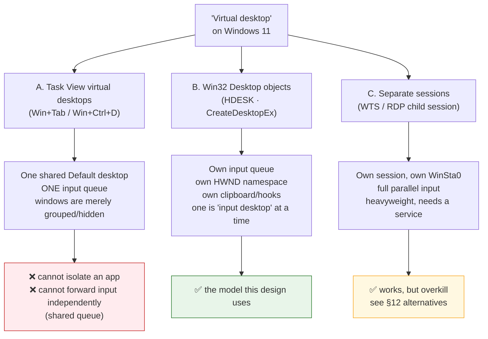
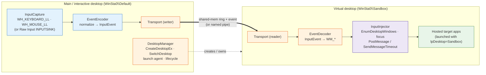
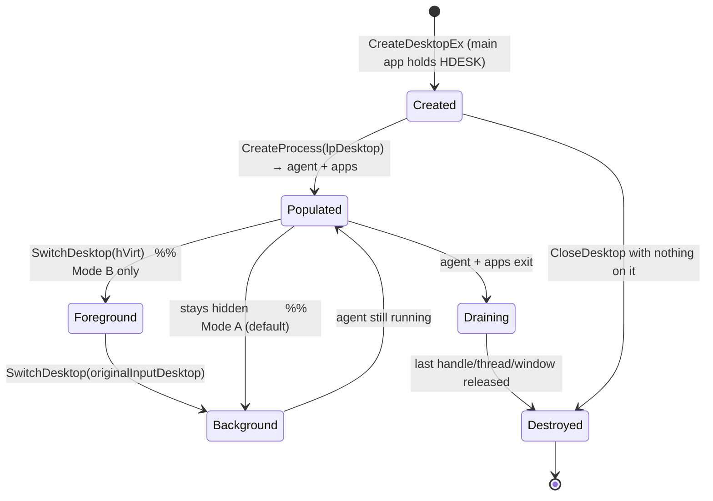
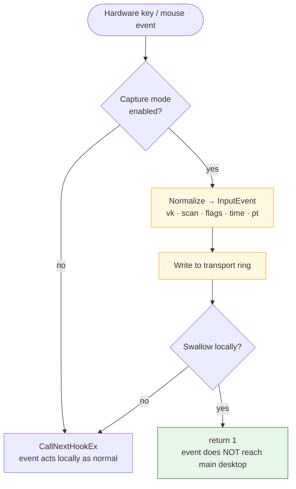
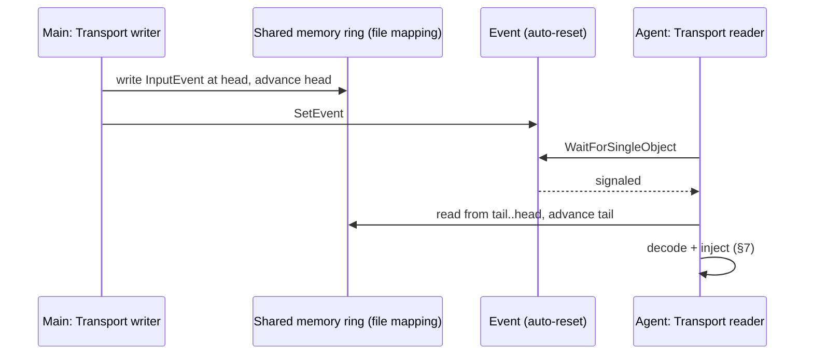
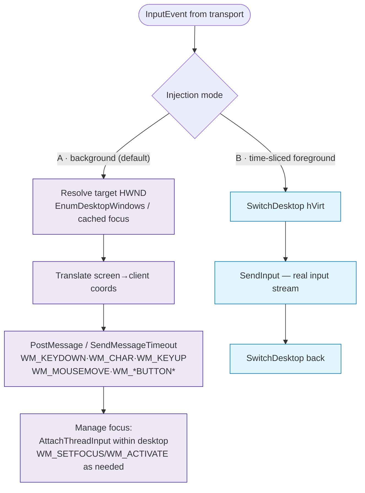
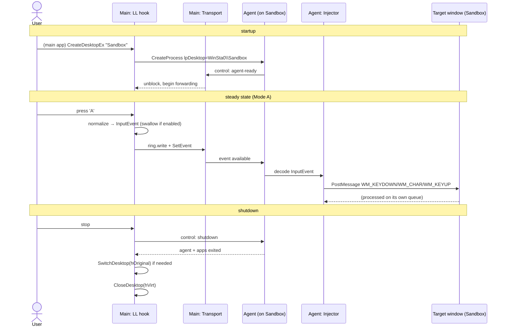

# Virtual Desktop Creation + Input Forwarding — Software Schematic

C++ / Windows 11. A **main desktop application** creates an isolated
*virtual desktop*, and a **companion agent** running inside that virtual
desktop receives input commands captured on the main desktop and injects
them into the applications hosted there.

This document is **design and analysis**. Illustrative Win32 signatures
are included because they *are* the substance of the analysis; they are
not a finished implementation. Diagrams are GitHub-flavored Mermaid
(```mermaid fenced blocks).

---

## 0. The word "virtual desktop" means three different things

This is the crux of the whole design, so it comes first. On Windows the
phrase maps to three unrelated mechanisms with very different isolation
and input behavior. Picking the wrong one makes the stated goal
(*forward input into an isolated desktop*) impossible.



| Model | API surface | Input isolation | Fit for this task |
|-------|-------------|-----------------|-------------------|
| **A. Task View** | `IVirtualDesktopManager` (public), `IVirtualDesktopManagerInternal` (undocumented, changes per build) | **None** — all Task View desktops share the *Default* desktop object and its single input queue | **No.** You cannot run an app "on" one in isolation, and there is no separate input stream to forward to. |
| **B. Desktop objects** | `CreateDesktopEx`, `SwitchDesktop`, `SetThreadDesktop`, `EnumDesktopWindows` | **Yes** — each `HDESK` has its own input queue, window list, hooks, clipboard | **Yes.** This is the chosen model. |
| **C. Separate session** | `WTSxxx`, child-session / RDP loopback, requires a Windows service in session 0 | **Full** — a real parallel input stream | Works, but heavyweight; reserved as an alternative (§12). |

**Decision:** the design uses **Win32 Desktop objects (`HDESK`)**. Everything
below is built on model **B**.

---

## 1. Why HDESK is the right primitive

A Win32 *desktop object* is a securable kernel object that owns a logical
display surface and, critically, its **own input queue and its own set of
top-level windows**. Classic uses: the UAC secure desktop, the logon
desktop (`Winlogon`), and the screensaver desktop.

Two facts make the whole forwarding architecture possible — and they are
the two facts to keep in mind throughout:

1. **Only one desktop per session is the *input desktop* at any instant.**
   `SwitchDesktop` selects it. Real hardware input — and anything from
   `SendInput` / `keybd_event` / `mouse_event` — flows to *that* desktop
   only. A hidden/background virtual desktop receives **no** hardware
   input. (This is the constraint that dictates the injection strategy in
   §7.)

2. **Desktops isolate USER/GDI objects, not kernel objects.** Window
   handles, hooks, clipboard, and the input queue are per-desktop. But
   named pipes, events, mutexes, and file mappings live in the **session**
   namespace and are fully shared across desktops. (This is what lets the
   two processes talk — see §6.)

### What is and isn't isolated between two desktops in one session

| Resource | Scope | Consequence for this design |
|----------|-------|-----------------------------|
| Keyboard/mouse hardware input | **Per input-desktop** | Background desktop gets nothing → must inject (§7) |
| `SendInput` / `keybd_event` | **Input desktop only** | Unusable for a hidden desktop (§7) |
| `HWND` namespace, `EnumWindows` | **Per desktop** | Agent enumerates *its* windows via `EnumDesktopWindows` |
| Windows hooks (`WH_*`) | **Per desktop** | Capture hook on main desktop only sees main-desktop input |
| Clipboard | **Per desktop** | Cross-desktop paste needs explicit relay |
| Foreground/focus/`GetAsyncKeyState` | **Per desktop** | Focus must be managed inside the target desktop |
| Named pipe, event, mutex, file mapping | **Per session (shared)** | ✅ the IPC transport works across desktops |
| Files, registry, sockets, handles | **Per session/process** | Shared normally |

---

## 2. Component layout



Two processes, two desktops, one session:

- **Main app** — runs on the interactive desktop the user sees. Owns the
  `HDESK` handle (keeping the virtual desktop alive), captures input,
  encodes it, and writes it to the transport.
- **Companion agent** — a separate process whose threads are bound to the
  virtual desktop. Reads events and injects them into the target windows
  living there.

---

## 3. Desktop creation

```c
// On the main app. Runs on WinSta0 (the interactive window station).
HDESK hVirt = CreateDesktopExW(
    L"Sandbox",          // desktop name (namespaced under the window station)
    NULL,                // lpszDevice   — must be NULL
    NULL,                // pDevmode     — must be NULL
    0,                   // DF_ALLOWOTHERACCOUNTHOOK or 0
    GENERIC_ALL,         // or the DESKTOP_* subset actually needed
    NULL,                // SECURITY_ATTRIBUTES — see §9 for ACL hardening
    0,                   // desktop heap KiB (0 = system default)
    NULL);
// hVirt must stay open: the desktop is destroyed when its last handle,
// thread, and window all go away (see §4).
```

Access-right vocabulary that matters here:

| Right | Needed by | For |
|-------|-----------|-----|
| `DESKTOP_CREATEWINDOW` | agent + hosted apps | create windows on the desktop |
| `DESKTOP_CREATEMENU` | hosted apps | menus |
| `DESKTOP_ENUMERATE` | injector | `EnumDesktopWindows` |
| `DESKTOP_READOBJECTS` / `DESKTOP_WRITEOBJECTS` | injector | read/post to windows |
| `DESKTOP_HOOKCONTROL` | injector (optional) | set hooks on the desktop |
| `DESKTOP_SWITCHDESKTOP` | main app | `SwitchDesktop` (Mode B, §7) |

**Window-station note.** Desktops belong to a window station. Only
`WinSta0` (the interactive one) can ever hold the input desktop, so the
virtual desktop must be created on `WinSta0` for input to be
deliverable/switchable. Desktops on a *non-interactive* window station
(the pattern a Windows **service** in session 0 would use) can host
windows and receive posted messages but can never become visible or
receive hardware input — which is fine for pure background message
injection but rules out Mode B.

### Launching the agent (and hosted apps) onto the desktop

A process is placed on a desktop at creation via `STARTUPINFO.lpDesktop`:

```c
STARTUPINFOW si = { sizeof(si) };
si.lpDesktop = (LPWSTR)L"WinSta0\\Sandbox";   // "<windowstation>\\<desktop>"
PROCESS_INFORMATION pi;
CreateProcessW(agentExe, cmdline, NULL, NULL, FALSE,
               0, NULL, NULL, &si, &pi);
```

Every thread the new process creates defaults to that desktop. A thread
can also move itself with `SetThreadDesktop(hVirt)` — but only *before* it
owns any window or hook, so it is done first thing in the agent's startup.

---

## 4. Desktop lifecycle

A desktop object is reference-counted. It survives while **any** of:
an open `HDESK` handle exists, a thread is associated with it, or it still
has a window. When all three drop to zero it is destroyed.



**Teardown ordering (main app):**
1. Signal the agent to exit (transport control message / named event).
2. Wait for agent + hosted apps to close their windows and threads.
3. If the virtual desktop is currently the input desktop, `SwitchDesktop`
   back to the original interactive desktop **first** — never leave a
   session with no input desktop.
4. `CloseDesktop(hVirt)`.

Always capture the original input desktop up front so step 3 is possible:

```c
HDESK hOriginal = OpenInputDesktop(0, FALSE, GENERIC_ALL);
// ... later ...
SwitchDesktop(hOriginal);
CloseDesktop(hOriginal);
```

---

## 5. Input capture on the main desktop

The capture hook is installed by the main app and, because hooks are
per-desktop, it only observes input on the interactive desktop — exactly
what we want to forward.



Two capture technologies, both viable:

| Technique | How | Pros | Cons |
|-----------|-----|------|------|
| **Low-level hooks** `WH_KEYBOARD_LL` / `WH_MOUSE_LL` | `SetWindowsHookEx(...,0)` on a thread with a message loop | Can **swallow** the event (return 1) → clean "forward instead of act locally" toggle | Runs on the installing thread's message pump; slow handlers get silently timed-out & bypassed |
| **Raw Input** `RIDEV_INPUTSINK` | `RegisterRawInputDevices` → `WM_INPUT` | Sees input even without focus; per-device data; scan codes | **Cannot** suppress the event locally |

Default: **LL hooks**, so a hotkey (e.g. a modifier chord) can toggle a
"forward + swallow" mode where keystrokes go *only* to the virtual desktop
and do not also drive the main desktop. Keep the hook callback minimal —
copy into the ring buffer and return; never do work inline.

---

## 6. Transport (IPC across desktops)

Because kernel objects are session-scoped (§1, fact 2), the two processes
on two desktops communicate normally. For a high-frequency input stream
the low-latency choice is a **shared-memory ring buffer + auto-reset
event**; a **named pipe** is the simpler drop-in when rates are modest.



| Transport | Latency | Complexity | When |
|-----------|---------|-----------|------|
| Shared-memory ring + event | lowest | moderate (lock-free SPSC) | high event rates, gaming-like feel |
| Named pipe `\\.\pipe\vdesk-in` | low | lowest | typical automation, control channel |

A tiny **control channel** (named pipe or named event) rides alongside for
lifecycle: `agent-ready`, `shutdown`, `flush`, `ack`. The main app blocks
on `agent-ready` before it starts forwarding.

### Normalized event schema

A single flat, fixed-size, POD record — trivially memcpy-able into the
ring, endian-irrelevant (same machine), versioned:

```c
enum class EvKind : uint8_t { KeyDown, KeyUp, Char,
                              MouseMove, MouseBtnDown, MouseBtnUp, Wheel };

struct InputEvent {          // fixed size, no pointers
    uint16_t version;        // schema version guard
    EvKind   kind;
    uint8_t  button;         // MK_* / VK_* for mouse buttons
    uint16_t vk;             // virtual-key code
    uint16_t scan;           // hardware scan code
    uint32_t flags;          // extended, injected, repeat, modifiers snapshot
    int32_t  x, y;           // screen coords at capture time
    int32_t  wheel;          // wheel delta
    uint64_t timeQpc;        // capture timestamp (QueryPerformanceCounter)
    uint32_t targetHint;     // optional: intended target window id, 0 = focus
};
```

---

## 7. Input injection on the virtual desktop

This is where the §1 constraint bites and drives the whole strategy.

> **`SendInput` / `keybd_event` / `mouse_event` inject into the session's
> current *input desktop*.** If the virtual desktop is hidden (not switched
> to), those APIs would land on the *visible* desktop — the wrong place.
> So the default injection path uses **targeted window messages**, which
> are delivered per-window regardless of which desktop is in front.



### Mode A — background message injection (default)

The agent stays on the hidden desktop; the user keeps using the main
desktop uninterrupted. For each event:

- **Locate the target window.** `EnumDesktopWindows(hVirt, ...)` yields the
  desktop's top-level windows; drill to the focused child. Cache the
  active target and refresh on focus-affecting events.
- **Keyboard.** Post `WM_KEYDOWN` → (`WM_CHAR` for text) → `WM_KEYUP`, with
  a correctly built `lParam`:

  | `lParam` bits | Meaning | Down | Up |
  |---------------|---------|------|-----|
  | 0–15 | repeat count | 1 | 1 |
  | 16–23 | scan code = `MapVirtualKey(vk, MAPVK_VK_TO_VSC)` | scan | scan |
  | 24 | extended key (arrows, R-Ctrl/Alt, etc.) | as source | as source |
  | 29 | context (Alt held) | 0 | 0 |
  | 30 | previous key state | 0 | 1 |
  | 31 | transition (1 = up) | 0 | 1 |

- **Mouse.** Post `WM_MOUSEMOVE`, `WM_LBUTTONDOWN/UP`, etc.:
  `lParam = MAKELPARAM(clientX, clientY)`, `wParam` = button/modifier mask
  (`MK_LBUTTON`, `MK_CONTROL`, …). Translate captured **screen** coords to
  the **target window's client** coords. Non-client hits may need
  `WM_NCHITTEST` / `WM_NCLBUTTONDOWN`; hovering may need `WM_SETCURSOR`.
- **Focus/async state.** Some apps read `GetAsyncKeyState` / `GetKeyState`
  rather than the message. `AttachThreadInput(agentThread, targetThread,
  TRUE)` (both on the same desktop) lets the injector share focus and key
  state so those reads see the synthetic keys.

**Honest limits of Mode A.** Posted messages are *not* real hardware
input. Apps that read via **DirectInput**, **Raw Input**, or poll
`GetAsyncKeyState` without an attached input queue — most notably games
and some anti-cheat-guarded apps — may ignore messages entirely. Message
injection is reliable for standard Win32/UWP controls, editors, browsers,
line-of-business apps; it is unreliable for exclusive-input/game surfaces.

### Mode B — time-sliced foreground injection (fallback)

When an app must see genuine hardware-level input: momentarily
`SwitchDesktop(hVirt)`, call `SendInput` (now landing on the real input
stream), then `SwitchDesktop` back to the user's desktop. This produces
authentic input but **steals the screen** for the duration and cannot run
concurrently with the user — it is a fallback for specific apps, not the
steady state. Requires `DESKTOP_SWITCHDESKTOP` and a physically
interactive session (blocked on the secure/locked desktop).

| | Mode A (message) | Mode B (SwitchDesktop + SendInput) |
|---|---|---|
| User can keep working | ✅ concurrent | ❌ screen is taken |
| Real hardware input | ❌ synthetic messages | ✅ genuine |
| Works on games/DirectInput | usually ❌ | usually ✅ |
| Runs while session locked | possible (background) | ❌ |
| Default? | **yes** | fallback per-app |

---

## 8. End-to-end sequence



---

## 9. Security, integrity, and access control

| Concern | Rule | Design response |
|---------|------|-----------------|
| **UIPI** (User Interface Privilege Isolation) | A lower-integrity process cannot post messages to a higher-integrity window; some messages are filtered | Run agent + hosted apps at the **same integrity level** as the main app; if crossing, use `ChangeWindowMessageFilterEx` on specific messages |
| **Desktop ACL** | A new desktop's DACL controls who can open/switch/create-window | Pass a tightened `SECURITY_ATTRIBUTES` to `CreateDesktopEx`; grant only the agent's token the rights it needs |
| **Session 0 isolation** | Services live in session 0 and cannot touch the user's `WinSta0` | Keep both processes in the **user's interactive session**; do not architect this as a session-0 service |
| **Secure desktop** | UAC/lock switches to the secure desktop; `SwitchDesktop` to it is denied | Mode B is unavailable while locked/elevated-prompt is up; Mode A background posting continues |
| **Handle lifetime = liveness** | Losing the `HDESK` can destroy the desktop under the agent | Main app holds the handle for the desktop's whole life (§4) |

---

## 10. Failure modes

| Case | Handling |
|------|----------|
| `CreateDesktopEx` fails (access / heap) | surface error; do not launch agent |
| Agent never signals `agent-ready` | main app times out, tears down desktop, reports |
| Transport ring overflow (producer faster than consumer) | drop-oldest with a lost-event counter, or backpressure the hook; never block the LL hook |
| Target app ignores posted messages (DirectInput/game) | detect no-effect; offer Mode B for that app (§7) |
| Focus lost / target window closed | re-resolve target via `EnumDesktopWindows`; buffer or drop until refound |
| UIPI blocks the post | align integrity levels; whitelist the message |
| Session locks (secure desktop) | Mode B suspended; Mode A continues if the desktop is non-interactive-safe |
| Main app crashes | agent detects broken transport/control event → self-terminates so the desktop drains |
| Desktop left as input desktop on exit | teardown always `SwitchDesktop(hOriginal)` before `CloseDesktop` |

---

## 11. Coordinate & timing model

- **Coordinates** are captured in **screen** space and injected in the
  **target window's client** space; the injector applies
  `ScreenToClient`-equivalent math against the resolved target's rect.
  DPI: capture and inject under the same DPI-awareness context, or convert
  explicitly (`GetDpiForWindow`).
- **Timing/order** is preserved by the SPSC ring (FIFO). Each event carries
  a QPC timestamp so the injector can optionally pace bursts (e.g. insert
  realistic key-repeat cadence) instead of firing back-to-back.

---

## 12. Alternatives considered (and why not the default)

| Alternative | What it is | Why not default |
|-------------|-----------|-----------------|
| **Task View virtual desktops** (`IVirtualDesktopManager`) | The Win+Tab feature | Shares one input queue and one Default desktop — **no isolation, nothing separate to forward to** (§0). Only `IVirtualDesktopManager` is public; the rest is undocumented and breaks across Windows builds. |
| **Separate WTS session / child session** | A full second logon session with its own `WinSta0` | Real parallel input, but needs a **session-0 service**, session plumbing, and licensing/policy considerations. Reserve for true simultaneous multi-user needs. |
| **RDP loopback to self** | Connect to `localhost` to spawn a second session | Heavy, disconnect/reconnect quirks, edition-gated; overkill for one isolated app surface. |
| **Kernel/filter-driver input injection** | Synthesize input below the message layer | Defeats the DirectInput limitation but requires a signed driver and a much larger security/attack surface; out of scope. |
| **Full VM (Hyper-V / Sandbox)** | Isolate in a guest and use enhanced-session redirection | Strongest isolation, but a different product; far more than "a desktop with a companion agent." |

---

## 13. What this schematic deliberately excludes

- A finished, buildable codebase — signatures here are illustrative.
- Clipboard, drag-and-drop, and file redirection between desktops.
- Screen/frame capture *out* of the virtual desktop (this doc covers input
  *in*, not video *out*).
- Multi-monitor virtual-display geometry.
- Driver-level input injection and anti-cheat interoperability.
- Cross-session (WTS/RDP) forwarding — noted as an alternative only (§12).
- Persistence of desktops across logoff/reboot (desktops are session-lived).
